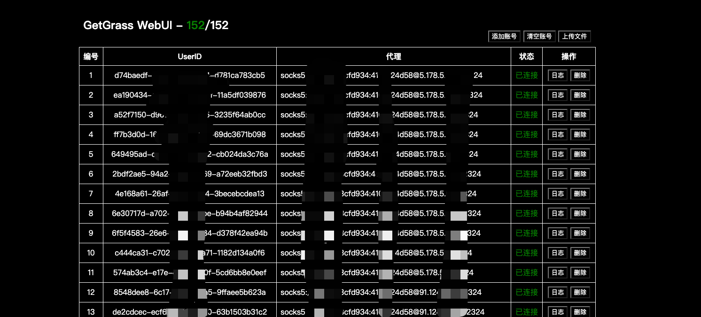

# Get Grass With WebUI

**This is a python tools for get grass score with multi accounts.**



### **直接运行**
1. ```pip3 install -r requirements.txt```
2. ```python3 main.py```
3. 浏览器访问`http://127.0.0.1:8000`
4. 点击上传文件 上传编辑好的 `account.txt`

### **Docker Compose 运行**
1. `git clone https://github.com/Confusion-ymc/GetGrassWebUI.git`
2. `docker compose up --build -d`
3. 浏览器访问`http://{容器ip}:8000`
4. 点击上传文件 上传编辑好的 `account.txt`

### 关于`account.txt`文件格式
- 不配置代理
  - **每一行是一个账号配置** 
  - **没有代理则直接是`user_id`为一行，----- 格式为`5242367b-d366-1234-987a-9ebd303fa8f5`**
- 配置代理
  - **如果使用代理则在后面加上`==代理连接`----格式为`5242367b-d366-1258-987a-9ebd303fa8f5==socks5://proxy.com:1080`**

- 例如：
 ```text
5242367b-d366-1234-987a-9ebd303fa8f5==http://proxy.com:8080
5242367b-d366-1234-987a-9ebd303fa8f5
5242367b-d366-1258-987a-9ebd303fa8f5==socks5://proxy.com:1080
 ```

